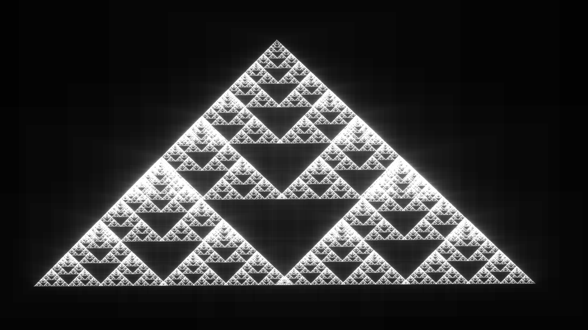
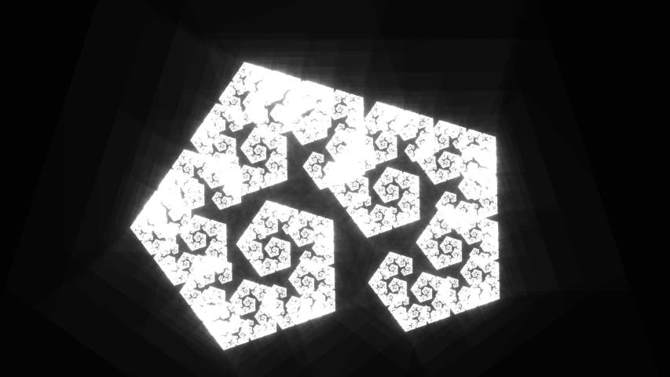
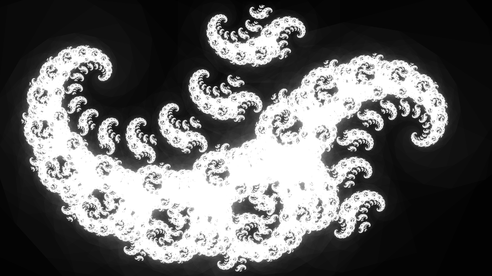

# Simple Fractals

A program to create interactable fractals in real-time, built in C++ using the SFML library.

The fractals themselves are generated by re-projecting the applications screen onto smaller, virtual, translucent sub-screens which can be translated, rotated and scaled by a user. When these sub-screens overlap, they become superimposed; this effect then recurses down the series of sub-screens allowing generation of fractals. 

I created this after seeing a Youtube video from the channel CodeParade (see <a href="https://www.youtube.com/watch?v=Pv26QAOcb6Q&t=0s">here</a>) in which he uses a webcam to record the screen. I couldn't be bothered setting up a webcam, so I instead created this app as a means of learning the basics of SFML.

## Controls
Once a sub-screen is created, it can be translated with left-click and drag. The other key-binds are:
- <kbd>Space</kbd> Add new sub-screen at mouse position
- <kbd>Right Mouse</kbd> Delete hovered sub-screen
- <kbd>Scroll</kbd> Rotate hovered sub-screen
- <kbd>Shift</kbd> + <kbd>Scroll</kbd>  Scale hovered sub-screen
- <kbd>Esc</kbd> Close the program

## Example Fractals

  
  
  
  

